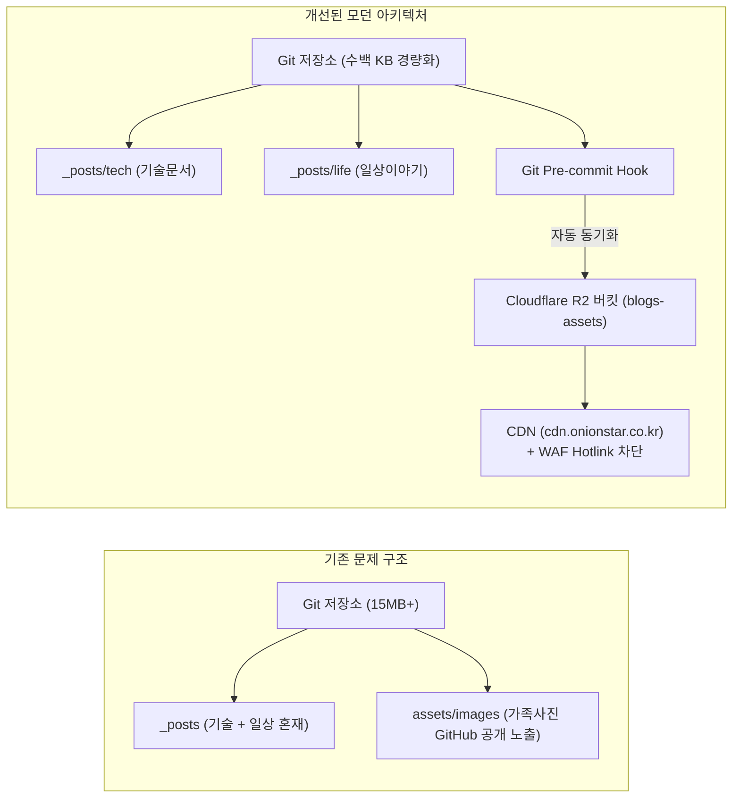

기존에 Jekyll 기반으로 운영하던 블로그에서 **"IT 기술 문서"**와 **"소중한 가족과의 일상 생활"**이라는 두 가지 성격의 글을 함께 기록하다 보니, 글이 쌓여갈수록 관리 편의성과 보안(사생활 보호) 측면에서 여러 한계에 부딪히게 되었습니다.

이번 포스트에서는 이러한 문제들을 근본적으로 해결하기 위해 진행한 **디렉토리 구조 체계화, UI/UX 디자인 개편, Cloudflare R2 기반의 미디어 자산 격리 및 자동 배포 파이프라인 구축 과정**을 상세히 정리합니다.

---

## 1. 개편 배경 및 기존 구조의 문제점

기존 블로그는 GitHub Pages와 Minima 기본 테마를 기반으로 운영되고 있었으며, 다음과 같은 구조적 불편과 보안 이슈가 있었습니다:

1. **포스트 및 카테고리 혼재**: `_posts/` 단일 디렉토리에 서버 구축기(`it`)와 육아 일기(`life`)가 시간순으로 뒤섞여 관리와 탐색이 어려움.
2. **미디어 파일의 GitHub 노출 (가장 심각 ⚠️)**: 가족 사진 등 개인적인 미디어가 공개(Public) GitHub 저장소에 올라가 누구나 Git 커밋 로그를 통해 원본 사진을 다운로드할 수 있었음.
3. **가독성 및 디자인 한계**: 기본 테마의 폰트 가독성이 떨어지고, 긴 기술 문서를 읽을 때 코드 블록 복사 등 편의 기능이 부재.



---

## 2. 콘텐츠 및 디렉토리 구조 체계화

Jekyll은 `_posts` 하위의 서브디렉토리를 자동으로 인식하여 포스트로 처리합니다. 이를 활용해 주제별로 깔끔하게 물리 디렉토리를 분리했습니다.

```text
blogs/
├── _config.yml              # 블로그 전역 설정 (R2 CDN URL 정의)
├── _config_dev.yml          # 로컬 개발용 오버라이드 (로컬 이미지 경로)
├── index.markdown           # 메인 홈 (히어로 배너 + 전체 최근 글)
├── tech.markdown            # /tech/ 기술 아카이브 전용 모아보기
├── life.markdown            # /life/ 일상 생활 전용 모아보기
├── about.markdown           # 블로그 및 작성자 소개
│
├── _posts/
│   ├── tech/                # 💻 기술 문서 모음
│   └── life/                # 🌿 일상/육아 이야기 모음
│
├── _layouts/                # 모던 레이아웃 (default, home, post, page)
├── _includes/               # 헤더, 푸터, 스크립트, 코드 복사 기능
├── scripts/                 # R2 동기화 및 Git Hook 자동화 스크립트
└── assets/
    └── main.scss            # Pretendard 기반 모던 스타일시트
```

### 전용 탐색 탭 신설
- [**`/tech/`**](/tech/): 기술 문서만 선별하여 표시 (총 편수 카운트 제공)
- [**`/life/`**](/life/): 일상 이야기만 선별하여 표시
- [**`/about/`**](/about/): 블로그 목적과 작성자 소개 정리

---

## 3. UI/UX 모던 디자인 개편

글을 읽는 피로도를 줄이고, 기술 문서로서의 전문성과 일상 기록의 따뜻함을 동시에 살릴 수 있는 **Slate & Indigo** 기반의 정갈한 디자인을 구축했습니다.

1. **Pretendard & JetBrains Mono 폰트 도입**: 국문과 영문, 코드 블록 모두에서 가장 깔끔한 가독성을 제공하는 웹폰트 스택 적용.
2. **Sticky Glassmorphism 헤더**: 상단 스크롤 시 부드러운 블러 효과와 함께 GitHub 프로필 아바타(`https://github.com/OnionStar0325.png`)를 브랜드 아이콘으로 연동.
3. **카테고리 뱃지 시스템**:
   - `Tech`: 차분한 인디고 블루 뱃지 (`#1d4ed8`)
   - `Life`: 따뜻한 에메랄드 그린 뱃지 (`#047857`)
4. **코드 블록 원클릭 복사 버튼**: 모든 코드 블록(`<pre>`) 우측 상단에 `Copy` 버튼을 자동 배치하여, 클릭 시 클립보드 복사 및 `✓ Copied!` 피드백 제공.

---

## 4. 미디어 자산 분리: Cloudflare R2 + WAF 핫링크 차단

사진 파일이 GitHub에 올라가지 않도록, **Cloudflare R2 Object Storage**로 미디어 저장소를 완전히 이전했습니다.

### Cloudflare R2 도입의 이점
- **비용 0원**: 매월 10GB 저장소, 읽기 1,000만 건, 쓰기 100만 건 무료 제공 및 **송출 트래픽 비용(Egress Fee) 0원**.
- **커스텀 도메인 연동**: `https://cdn.onionstar.co.kr`을 통해 Cloudflare 글로벌 엣지 CDN 캐싱 적용.

### WAF(방화벽)를 통한 무단 직접 다운로드 차단
R2 사진 주소를 익명으로 직접 치고 들어오거나 타 사이트에서 불펌하는 것을 방지하기 위해 Cloudflare WAF 사용자 지정 규칙을 적용했습니다.

* **WAF 필터링 수식**:
```text
(http.host eq "cdn.onionstar.co.kr" and not http.referer contains "onionstar.co.kr" and not http.referer contains "localhost" and not http.referer contains "100.126.81.56")
```
- **동작**: 블로그(`onionstar.co.kr`) 페이지를 통한 정상 요청만 허용하고, 익명 주소창 직접 입력이나 외부 링크는 **`403 Forbidden`**으로 즉시 차단.

---

## 5. 로컬 작성 ⇄ R2 자동 동기화 워크플로우

글을 작성할 때마다 매번 수동으로 R2 대시보드에 사진을 올리는 것은 매우 번거롭습니다. 이를 위해 **"로컬에서 사진을 넣고 테스트한 뒤, 커밋 시 자동으로 R2에 올라가는 파이프라인"**을 구축했습니다.

### ① 로컬 개발 설정 분리 (`_config_dev.yml`)
- 운영 배포 (`_config.yml`): `cdn_url: "https://cdn.onionstar.co.kr"`
- 로컬 개발 (`_config_dev.yml`): `cdn_url: "/assets/images"`

포스트 본문에는 언제나 통일된 형식으로 작성합니다:
```markdown

```

로컬 서버 실행 시 `./serve.sh`를 실행하면, 아직 R2에 올리지 않은 로컬 `assets/images/` 내의 사진도 엑박 없이 브라우저에서 즉시 미리보기가 가능합니다.

### ② Python R2 동기화 스크립트 (`scripts/sync_r2.py`)
`boto3`를 사용하여 `assets/images/`에 새로 추가되거나 크기가 변경된 이미지만 선별하여 R2 버킷(`blogs-assets`)으로 동기화합니다.

### ③ Git Pre-commit Hook 연동 (`scripts/pre-commit.sh`)
Git 커밋 시점에 훅이 자동으로 작동하도록 설정하여 커밋 전 새 이미지를 R2에 먼저 업로드합니다:

```bash
git add _posts/
git commit -m "feat: 새 포스트 작성"
# 🚀 Pre-commit Hook이 실행되며 새 이미지를 R2로 자동 업로드 후 커밋 완료!
```

---

## 6. Git 히스토리 영구 세척 (Git History Purge)

기존 커밋 기록에 남아 있던 과거 가족 사진 바이너리(약 15MB)를 `git-filter-repo` 도구로 영구 소거했습니다.

```bash
# 과거 모든 커밋에서 assets/images 폴더 기록 영구 소거
git-filter-repo --path assets/images --path card.jpg --invert-paths --force
```

- **결과**: 저장소 크기가 약 15MB에서 **100KB 대**로 대폭 축소되었으며, 과거 커밋에서도 사진이 완전히 제거되어 사생활과 보안 문제를 근본적으로 해결했습니다.
- **인증 보안 강화**: 4096-bit RSA GPG 커밋 서명(`Verified` 뱃지) 및 Ed25519 SSH 인증 체계를 구축했습니다.

---

## 7. 정리 및 기대 효과

| 항목 | 개편 전 | 개편 후 |
| :--- | :--- | :--- |
| **콘텐츠 분류** | `_posts/` 단일 폴더 혼재 | `_posts/tech/`, `_posts/life/` 하위 폴더 분리 |
| **카테고리 탐색** | 메인 페이지 단순 시간순 나열 | `/tech/`, `/life/` 전용 탭 및 카운트 칩 제공 |
| **미디어 저장소** | GitHub 공개 저장소 직접 커밋 | **Cloudflare R2 + CDN 격리 (비용 0원)** |
| **이미지 보안** | 누구나 원본 사진 열람/다운로드 가능 | **WAF 핫링크 차단 (블로그 요청만 200 허용)** |
| **글 작성 경험** | 수동 업로드 또는 Git 용량 비대화 | **로컬 즉시 미리보기 + 커밋 시 자동 R2 동기화** |
| **코드 블록** | 단순 텍스트 표시 | **원클릭 클립보드 복사 버튼 (`Copy`)** |

이번 개편을 통해 **"코드는 GitHub에 가볍고 안전하게, 미디어는 Cloudflare R2에 빠르고 프라이빗하게"** 관리할 수 있는 탄탄한 블로그 운영 기반을 갖추게 되었습니다. 앞으로 기술 문서와 소중한 일상을 더욱 편안하게 기록해 나갈 예정입니다.
