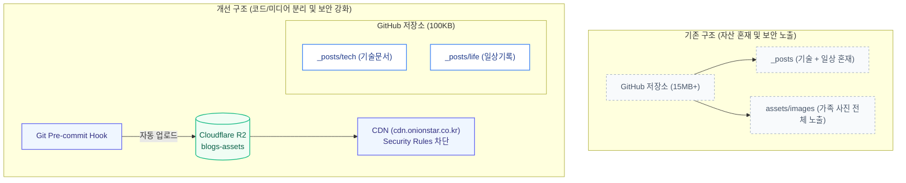

Jekyll 기반 블로그에서 기술 문서와 일상 생활 기록을 함께 관리하며 발생한 구조적 문제와 보안 문제를 해결하기 위해 블로그 구조를 개편했습니다.

이번 글에서는 디렉토리 구조 변경, 테마 개선, Cloudflare R2를 활용한 이미지 자산 분리 및 Git Pre-commit Hook 자동화 과정을 정리합니다.

---

## 1. 개편 배경 및 문제점

기존 블로그는 GitHub Pages와 Minima 기본 테마를 사용하고 있었으며, 다음과 같은 문제가 있었습니다.

1. **포스트 및 카테고리 혼재**: `_posts/` 단일 디렉토리에 IT 기술 글과 일상 글이 섞여 있어 파일 관리가 불편함.
2. **개인 사진의 Github 저장소 노출**: 가족 사진이 공개 GitHub 저장소에 커밋되어 Git 로그를 통해 원본 파일이 노출됨.
3. **가독성 및 기능 부재**: 기본 테마의 가독성이 낮고, 코드 블록 복사 기능이 없음.



---

## 2. 디렉토리 구조 변경

Jekyll은 `_posts` 하위 디렉토리를 기본적으로 인식합니다. 이를 활용하여 주제별로 디렉토리를 분리했습니다.

```text
blogs/
├── _config.yml              # 블로그 전역 설정 (R2 CDN URL 정의)
├── _config_dev.yml          # 로컬 개발용 설정 (로컬 이미지 경로)
├── index.markdown           # 메인 홈
├── tech.markdown            # /tech/ 기술 아카이브 페이지
├── life.markdown            # /life/ 일상 생활 페이지
├── about.markdown           # 소개 페이지
│
├── _posts/
│   ├── tech/                # 기술 문서
│   └── life/                # 일상 기록
│
├── _layouts/                # 레이아웃 (default, home, post, page)
├── _includes/               # 헤더, 푸터, 스크립트
├── scripts/                 # R2 동기화 및 Git Hook 스크립트
└── assets/
    └── main.scss            # 스타일시트
```

### 카테고리 페이지 분리
- **`/tech/`**: 기술 문서만 목록화하여 출력
- **`/life/`**: 일상 글만 목록화하여 출력
- **`/about/`**: 블로그 소개

---

## 3. 테마 및 디자인 개선

기본 테마 디자인을 가독성을 고려하여 개선했습니다.

1. **폰트 적용**: 국/영문 및 코드 가독성을 위해 Pretendard와 JetBrains Mono 폰트를 적용했습니다.
2. **헤더 및 브랜드 표시**: 상단 네비게이션에 GitHub 프로필 아바타를 연동하고 메뉴 활성 상태(Active)를 표시하도록 했습니다.
3. **카테고리 구분**: Tech(블루)와 Life(그린) 뱃지를 적용하여 글 구분을 명확히 했습니다.
4. **코드 블록 복사 버튼**: 코드 블록 우측 상단에 클립보드 복사(Copy) 버튼을 추가했습니다.

---

## 4. 미디어 자산 분리: Cloudflare R2 및 보안 설정

사진 파일이 GitHub 저장소에 올라가지 않도록 Cloudflare R2 Object Storage로 미디어 자산을 분리했습니다.

### Cloudflare R2 구성
- 월 10GB 저장소 및 송출 트래픽 비용(Egress Fee) 무료 제공 활용.
- 커스텀 도메인(`https://cdn.onionstar.co.kr`) 연결을 통한 CDN 캐싱 적용.

### Security Rules를 통한 외부 무단 요청 차단
R2에 저장된 이미지 주소의 직접 접근 및 무단 링크를 방지하기 위해 Cloudflare 대시보드의 **Security > Security rules**에 사용자 지정 규칙을 적용했습니다.

* **수식**:
```text
http.host eq "cdn.onionstar.co.kr" and not http.referer contains "onionstar.co.kr"
```
* **동작**: `onionstar.co.kr` 도메인을 통한 정상 요청만 허용하고, 그 외 직접 요청 및 외부 요청은 `403 Forbidden`으로 차단합니다.


---

## 5. 로컬 작성 및 R2 자동 동기화

로컬에서 이미지를 확인하며 글을 작성하고, 커밋 시점에 R2로 자동 업로드되는 구조를 구성했습니다.

### ① 설정 분리 (`_config_dev.yml`)
- 운영 환경 (`_config.yml`): `cdn_url: "https://cdn.onionstar.co.kr"`
- 로컬 환경 (`_config_dev.yml`): `cdn_url: "/assets/images"`

포스트 작성 시에는 다음과 같이 통일하여 작성합니다.
```markdown

```

`./serve.sh` 실행 시 로컬의 `assets/images/` 경로를 참조하여 즉시 미리보기가 가능합니다.

### ② 동기화 스크립트 (`scripts/sync_r2.py`)
Python `boto3`를 사용하여 `assets/images/` 내의 신규 및 변경된 이미지만 R2 버킷(`blogs-assets`)으로 동기화합니다.

### ③ Git Pre-commit Hook 연동 (`scripts/pre-commit.sh`)
커밋 실행 시 훅이 동작하여 새 이미지를 R2에 업로드한 뒤 커밋을 진행합니다.

```bash
git add _posts/
git commit -m "feat: 새 포스트 작성"
# Pre-commit Hook에 의해 이미지 R2 자동 업로드 후 커밋 완료
```

---

## 6. Git 히스토리 정리 (Git History Purge)

기존 커밋에 포함되어 있던 이미지 파일(약 15MB)을 `git-filter-repo`로 소거했습니다.

```bash
git-filter-repo --path assets/images --path card.jpg --invert-paths --force
```

- 저장소 크기를 100KB대로 경량화하고 과거 커밋의 개인 사진 노출을 제거했습니다.
- 커밋 검증을 위해 4096-bit RSA GPG 서명 및 Ed25519 SSH 인증을 구성했습니다.

---

## 7. 정리

| 항목 | 개편 전 | 개편 후 |
| :--- | :--- | :--- |
| **콘텐츠 분류** | `_posts/` 단일 폴더 | `_posts/tech/`, `_posts/life/` 하위 폴더 분리 |
| **카테고리 탐색** | 메인 페이지 전체 나열 | `/tech/`, `/life/` 전용 페이지 분리 |
| **미디어 저장소** | GitHub 저장소 직접 커밋 | Cloudflare R2 + CDN 분리 |
| **이미지 보안** | 파일 직접 노출 | Security Rules 적용 (블로그 요청만 허용) |
| **작성 편의성** | 수동 관리 | 로컬 미리보기 + 커밋 시 R2 자동 동기화 |
| **코드 블록** | 텍스트 표시 | 클립보드 복사 버튼 추가 |

코드 파일은 GitHub에서 관리하고, 미디어 자산은 Cloudflare R2에서 분리 관리함으로써 보안성과 관리 편의성을 개선했습니다.
